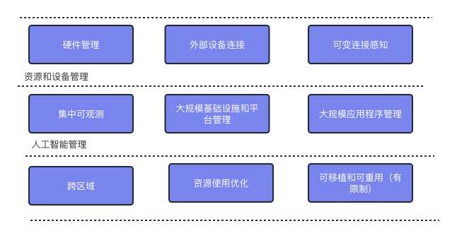

# 边缘原生应用原则

发布日期：2023年1月17日（第一版），2022年10月24日（草稿）

## 目标

“边缘原生”一词已经在许多地方提到，比如 [Gartner](https://blogs.gartner.com/thomas_bittman/2020/04/17/cloud-native-isnt-edge-native/), [Macrometa](https://www.macrometa.com/blog/edge-native-is-not-cloud-native), 和 [FutureCIO](https://futurecio.tech/cloud-native-versus-edge-native-know-the-difference/). 像 [State of the Edge](https://github.com/State-of-the-Edge/glossary/blob/master/edge-glossary.md#edge-native-application) 和 [Linux Foundation](https://www.lfedge.org/wp-content/uploads/2020/07/LFedge_Whitepaper.pdf) (LF) 这样的组织也在讨论边缘原生应用，但还没有关注边缘原生应用原则。

本白皮书侧重于边缘原生应用程序以及如何定义这些应用原则。

## 什么是边缘？

边缘计算使数据处理更接近源头，例如，在工厂中控制机器人。 未来五年，边缘计算将变得更加普遍，该行业预计从 [2022年到2030年将增长38.9%](https://www.grandviewresearch.com/industry-analysis/edge-computing-market). 很多公司正在看到以下将计算能力放在边缘的好处:

- 减少延迟
- 限制带宽
- 增强敏感数据的安全
- 不可靠网络下的稳定运行

有多种边缘计算定义存在，但本文将重点关注基于数据资源所处的地理位置的边缘计算。基于地理位置的边缘被分类为多个类别，具体取决于与用户的距离。下图显示了根据 [Linux基金会边缘白皮书](https://www.lfedge.org/wp-content/uploads/2020/07/LFedge_Whitepaper.pdf) 定义的类别。

边缘原生原则与云原生原则存在许多相似之处，但也有一些关键的区别。
## 云原生 vs 边缘原生

根据 [云原生基金会(CNCF)](https://github.com/cncf/foundation/blob/main/charter.md) 的定义，云原生技术是:

>*"云原生技术赋予组织在现代动态环境中构建和运行可扩展的应用程序的能力，例如公有云、私有云和混合云。容器、服务网格、微服务、不可变基础架构和声明式 API 是这种方法的典范。*
>
>*这些技术使得松散耦合的系统具有弹性、可管理和可观测性。结合强大的自动化，它们允许工程师频繁且可预测地进行高影响的更改，最大限度地减少繁琐工作。"*

这一广泛的使命对于边缘应用仍然适用，因为 [开放边缘计算术语表](https://github.com/State-of-the-Edge/glossary/blob/master/edge-glossary.md#edge-native-application) 指出，“边缘原生应用”利用了云原生原则：

>*“本地构建的应用程序利用边缘计算能力，而在集中式数据中心操作这些应用程序将是无法实现或不可取的。边缘原生应用程序利用云原生原则，同时考虑边缘的独特特性，例如资源限制、安全性、延迟和自治性。边缘原生应用程序的开发方式利用云能力，并与上游资源协同工作。不关心中心云计算资源、远程管理和编排或利用 CI/CD 的边缘应用程序并不真正“原生”，而更类似于传统的本地应用程序。”*

随着云原生用例涉及传统云以外的边缘位置的数据和事件，新的工具和技术正在不断发展，以实现松散耦合的系统，具有弹性、可管理和可观测性，同时管理边缘的独特性。

## 边缘原生与云原生的相似性

边缘原生与云原生有许多相似之处，本节将描述这些相似之处。

|                属性               |                                                                                                     云原生 与 边缘原生                                                                                                     |
|:---------------------------------------:|:-----------------------------------------------------------------------------------------------------------------------------------------------------------------------------------------------------------------------------------:|
| 应用和服务的可移植性           | 应用和服务将它们与基础设施的耦合分离。一个良好编写的应用程序不需要知道它运行的位置，可以支持在平台之间移植。                                                   |
| 可观测性                           | 平台配备了一套良好的文档接口和工具选项，以便检测问题和收集指标。这使得开发人员可以构建具有弹性和高效管理的系统。 |
| 可管理性                           | 提供接口和工具选项以规模化管理应用程序和资源。平台还具有插件机制，以提供基础网络连接、服务和管理功能。                    |
| 支持多种语言和框架 | 应用程序和服务可以使用各种流行的语言和框架实现。                                                                                                                               |

## 边缘原生与云原生的区别

边缘原生和云原生的广泛使命有相似之处，但开发人员应该意识到不同之处。

|              属性              |                                                                                    云原生                                                                                   |                                                                                                                                         边缘原生                                                                                                                                        |
|:------------------------------------:|:---------------------------------------------------------------------------------------------------------------------------------------------------------------------------------:|:------------------------------------------------------------------------------------------------------------------------------------------------------------------------------------------------------------------------------------------------------------------------------------------:|
| 应用模型                            | 大多数微服务组件是支持水平扩展的无状态服务。                                                                                     | 虽然服务提供的边缘应用程序非常相似，但用户边缘应用程序可能是单独的个体程序；在这些情况下，状态与应用程序相关联。                                                                                                                              |
| 数据模型                           | 常见的是支持无状态组件的集中式模型。                                                                                                                         | 常常采用缓存、流式处理、实时和分布式模型。                                                                                                                                                                                                                 |
| 弹性                           | 快速启动和关闭；通常将底层资源视为无限制。                                                                                                     | 由于边缘设备的硬件资源受限，弹性受到限制；如果需要更多资源，会通过请求云端进行“垂直”扩展。                                                                                                                                                   |
| 稳定性                           | 将稳定性外包给云提供商，使用分布在不同地域的冗余节点。                                                                                    | 通常依赖于经过强化的基础设施，具有面向有状态组件的恢复架构；在许多情况下，稳定性可能比云上的稳定性低。                                                                                                                                    |
| 规模                                | 通常限于少数区域和实例                                                                                                                                  | 可以支持大规模区域（高达数万个），支持大量外部设备（高达数十万个）                                                                                                                                                                |
| 编排                        | 大型公有或私有云中的编排旨在通过在集中池化的主机上运行工作负载（以水平方式调度）来实现效率和可用性。 | 边缘是分散的，工作负载以分布式方式部署，通常以指定区域的方式调度。                                                                                                                                                                           |
| 管控                           | 虽然云原生和边缘原生都是可管控的，但机制有所不同；云原生依赖于集中管控和自动化。                                            | 边缘原生需要远程和集中管控的混合方式以及硬件和软件的无接触部署。边缘的运维人员可能没有接受过培训，人数很少，甚至不存在。升级流程需要具有原子性和一致性，防止设备升级失败导致不可用。 |
| 网络                           | 应用程序可以依赖高速网络。                                                                                                                      | 应用程序需要考虑各种网速（不稳定、比较差、非常好）和功能。包括基于移动和无线的，集成来自非IP协议网络的数据和事件。                                                                                          |
| 安全                             | 安全管控的基础设施。                                                                                                                                         | 不可信不安全环境中的“零信任”。                                                                                                                                                                                                                                                       |
| 硬件配置                  | 很少需要关注硬件配置，能适用于大多数应用程序。                                    | 应用程序可能具有更高的实时要求，使得硬件平台、位置和安全意识成为必需。开发人员需要了解更广泛的硬件和接口。                                                                                      |
| 与外部资源交互  | 应用程序很少需要与本地硬件资源交互。                                                                                                               | 在边缘部署的服务通常需要与本地环境交互：相机、传感器、执行器、用户等。                                                                                                                                                              |

## 边缘原生应用

边缘原生应用是为边缘设计的应用和服务。它们参考以上相似性和差异性编写。以下是这些应用的核心原则。

## 边缘原生原则

为了实现本文前面提到的边缘原生的使命，边缘原生应用应遵循以下原则。

| 原则                                            | 描述                                                                                                                                                                                                                                                                                                                                                                                                                                                                                                                                                                                                                                                                                       |
|------------------------------------------------------|---------------------------------------------------------------------------------------------------------------------------------------------------------------------------------------------------------------------------------------------------------------------------------------------------------------------------------------------------------------------------------------------------------------------------------------------------------------------------------------------------------------------------------------------------------------------------------------------------------------------------------------------------------------------------------------------------|
| 硬件管理能力                                      | 开发人员需要了解广泛的硬件平台和接口，而不是只有同质化的硬件平台。                                                                                                                                                                                                                                                                                                                                                                                                                                                                                                                                                                   |
| 外部设备连接                         | 应用程序必须知道如何连接其环境中的设备，并了解运行时的功能变化。例如，它们在初始化配置后，能响应传感器连接/断开或新设备接入的情况。功能并不固定，需要考虑应用的环境，因此编排器需要能够协调应用程序状态和功能变化。                                                                                                                                                                                                                                                                         |
| 可变连接感知                       | 应用程序必须适应不可靠甚至无法使用（完全隔离）的网络连接，使用异步通信、排队和缓存等机制。当边缘从中心站点获取配置时，可能需要使用“拉取”机制来克服规模、网络连接和安全问题。                                                                                                                                                                                                                                     |
| 集中可观测                                | 虽然边缘和云原生应用程序都需要集中可观测，但边缘原生应用具有独特的考虑因素。边缘原生应用程序可能被部署到大规模实例中，存在运维人员和现场支持受限的情况。因此，需要采用数据分布式收集和集中聚合、开放式环路（人员可观察/可操作）和闭合环路自动化等技术。可观测性包括指标、日志、数字孪生、警报（事件和警报）和健康监测。                                                                                                                 |
| 大规模基础设施和平台管理       | 基础设施和平台的管理在大规模边缘应用上非常重要，需要支持声明式的管理。此外，可能存在一些特殊的要求，例如设备接入、横向扩展限制、管理裸机环境等。在平台层面，部署或管理Kubernetes或虚拟化层以及各种插件也是一个问题；需要保持平台层面的供应商中立，以实现应用程序的可移植性。                                                                                                                                                                     |
| 大规模应用程序管理                      | 应用程序的数量和这些应用程序的实例数量在边缘可能非常大，需要基于声明式的规则和条件来配置、通过自动化服务生效，以及跨多个应用程序实例的聚合管理视图。应用程序也可能有实时需求，这意味着应用程序和基础设施平台之间的联系（例如使用 GPU、DPU、FPGA、CPU 架构、内核优化、Kubernetes 插件）可能比云应用程序更紧密。换句话说，应用程序编排可能触发底层的基础设施和平台编排。 |
| 跨区域                                             | 应用程序不止部署在一个区域，存在跨区域的延迟和故障。事实上，边缘应用程序也可能跨公有云、私有云。                                                                                                                                                                                                                                                                                                                                                                                                                                                                                                        |
| 资源使用优化                          | 由于边缘计算资源受限，应用程序必须持续优化资源使用。按需调整应用程序，基于部署位置和可用性意图的迁移和伸缩。这意味着在一天的时间里存在不同的运行工作负载。                                                                                                                                                                                                                                                                                                                                                         |
| 应用程序可移植和可重用（有限制) | 抽象层试图通过供应商中立的 PaaS 提供与基础设施和平台无关的可移植性。但由于本地资源、硬件平台、安全、移动网络等限制，配置选项需要适应本地差异。                                                                                                                                                                                                                                                                                                                                                                                                       |

### 分组边缘原生原则

这九项原则可以归纳为一组较小的五项原则。硬件管理、外部设备连接、网络的变化和可用性感知都可以在更广泛的资源和硬件管理原则下考虑。同样，边缘应用可大规模管理、可集中观测以及具有可管理的基础设施和平台，这些都可以归类为大规模管理的原则。以下是扩展的五个原则：跨区域、资源使用优化、可移植和可重用限制、资源和硬件管理以及规模管理。

## 结论和后续步骤

本文为第一版，可能会进行修订。后面会有一些与本文的子内容相关的论文。

## 如何参与

CNCF IoT Edge 工作组有定期会议、邮件列表和 Slack。有关最新信息，请参阅工作组 GitHub 页面的 [通信部分](https://github.com/cncf/tag-runtime/blob/master/wg/iot-edge.md#communication) 我们欢迎读者参与，介绍 Edge 相关项目，为小组的工作领域提出想法，或帮助修改本白皮书和起草后续文件。

## 边缘原生开源项目和计划的工作列表

作为本文的一部分，CNCF IoT Edge 工作组正在收集开源项目的工作列表，这些项目可帮助应用程序开发人员实现本文中概述的边缘原生应用程序原则。

可以在 [此电子表格](https://docs.google.com/spreadsheets/d/1dfa3lUvLuCrzmTH1w1TLeXxU-gy6QfbsE_ZXd1h4zTI/edit#gid=0) 中或通过二维码找到该列表。要获得添加项目的编辑权限，请加入[IoT Edge Working Group Google 群组](https://groups.google.com/forum/#!forum/kubernetes-wg-iot-edge).

## 贡献者

### 作者

Amar Kapadia, Aarna Networks
Brandon Wick, Aarna Networks
Joel Roberts, Cisco
Kate Goldenring, Fermyon
Dejan Bosanac, Red Hat
Tomoya Fujita, Sony US Lab
Ravi Chunduru, Verizon
Natalie Fisher, VMware
Steven Wong, VMware  

### 审稿人

Frédéric Desbiens, Eclipse Foundation
Prakash Ramchandran, eOTF
Mark Abrams, SUSE

## 参考资料

Linux Foundation Edge  Whitepaper: https://www.lfedge.org/wp-content/uploads/2020/07/LFedge_Whitepaper.pdf

Open Glossary of Edge Computing [v2.1.0] State of the Edge: https://github.com/State-of-the-Edge/glossary/blob/master/edge-glossary.md#edge-native-application

Cloud Native Computing Foundation (CNCF) Charter: https://github.com/cncf/foundation/blob/main/charter.md

Gartner ‘Cloud Native Isn’t Edge Native’: https://blogs.gartner.com/thomas_bittman/2020/04/17/cloud-native-isnt-edge-native/

Macrometa ‘Edge Native is not Cloud Native’: https://www.macrometa.com/blog/edge-native-is-not-cloud-native

Future CIO ‘Cloud-Native versus Edge-Native: know the difference’: https://futurecio.tech/cloud-native-versus-edge-native-know-the-difference/

Edge Computing Market Size, Share & Trends Analysis Report By Component (Hardware, Software, Services, Edge-managed Platforms), By Application, By Industry Vertical, By Region, And Segment Forecasts, 2022 - 2030
https://www.grandviewresearch.com/industry-analysis/edge-computing-market
